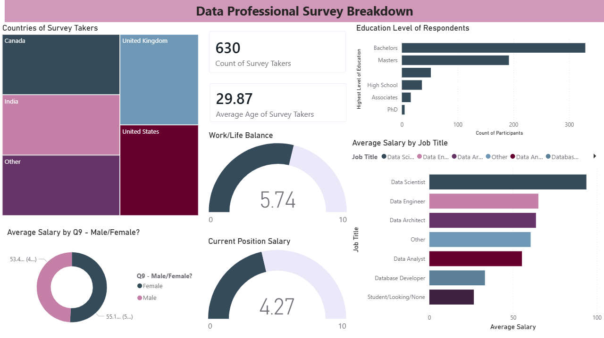
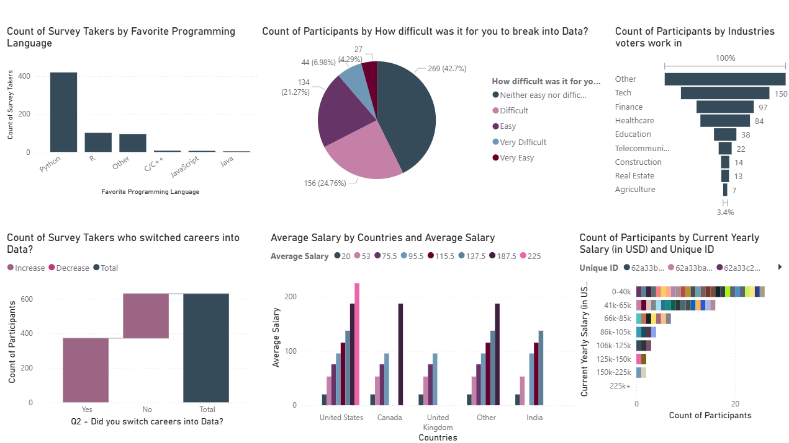

# Data Professional Survey Analysis - Power BI Project

## Project Overview

This project presents a detailed analysis of the **Data Professional Survey**, covering responses from **630 participants** worldwide. The goal of this dashboard is to provide a clear picture of the data industry in 2022-2023, focusing on salary benchmarks, popular technologies, career transition patterns, and overall job satisfaction.

The analysis helps answer key questions like:

* Which programming languages are most dominant in the market?

* How does location and job title affect salary?

* What is the reality of work-life balance for data professionals?

---

## Dataset Information

The analysis is based on a survey dataset containing the following key information:

- **Demographics:** Age, gender, and country of the respondents.

- **Career Path:** Current job title, previous industry, and career switch status.

- **Technical Stack:** Favorite programming languages (Python, R, SQL, etc.).

- **Financials:** Yearly salary ranges in USD.

- **Satisfaction Metrics:** Work-life balance and salary satisfaction.

---

## Visualization Steps

The project followed a standard data analytics workflow:

1. **Data Cleaning (Power Query):** - Cleaned inconsistent job titles and country names.

- Handled missing values in the salary and programming language columns.

- Split columns where necessary to extract cleaner categories.

2. **Data Modeling:** - Created a dedicated "Measures" table for key metrics.

- Calculated `Average Age`, `Count of Respondents`, and `Average Salary`.

3. **DAX Measures:** - Developed custom DAX expressions for dynamic filtering and aggregations.

4. Used **Gauge Charts** for satisfaction metrics and **Treemaps** for geographic distribution.

---

##  Dashboard Preview

### 1. General Demographics & Role Breakdown

*Insights: Majority of the workforce is concentrated in the US and India, with Bachelors and Masters being the primary education levels.*

### 2. Market Trends \& Salary Insights

*Insights: Python is the leading language. There is a visible salary premium for Data Scientist and Data Architect roles.*

---

